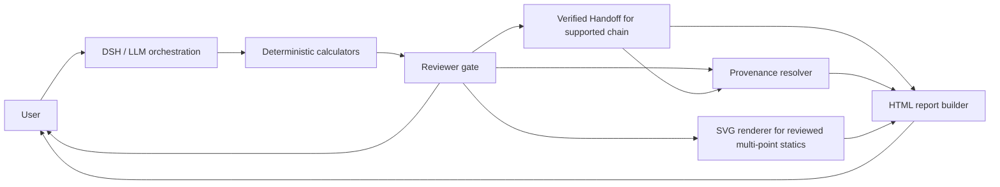

# Mechanical Design Agent

**Current release:** 0.1.0 · **v0.2 candidate:** under review · **License:** [MIT](LICENSE)

## Start here (Windows)

1. Double-click [start-mechanical-dsh.cmd](start-mechanical-dsh.cmd) in this folder.
2. Wait for the browser to open automatically.
3. Enter the **mechanical** session.
4. Describe the mechanical problem in ordinary language. For example:

> Analyze verified two-plane shaft strength: power 5.5 kW, speed 960 rpm, simply supported span 600 mm, plane 1 signed point load -1000 N at 200 mm, plane 2 signed point load -1000 N at 400 mm, allowable shear stress 40 MPa. Report the same-station critical resultant and both critical positions, the signed plane components, all three Reviewer statuses, and the theoretical minimum diameter.

The launcher builds the local plugin and starts the restricted Web runtime. Keep its terminal window open while using the session. Initial developer setup and prerequisites are in [Developer setup](#developer-setup).

## Supported verified workflows

- Transmitted torque from power and speed.
- The existing one-plane, simply supported point-load shaft-strength workflow.
- Signed two-plane, simply supported point-load shaft-strength workflow. Its resultant combines the two bending components **at the same shaft station**.

The reported `d_min` is a **theoretical minimum strength diameter**, not a selected production diameter. Actual design still needs a preferred diameter choice and checks for stress concentration, fatigue, stiffness, and bearing or other machine-element fit.

The verified workflows do not cover distributed loads, applied couples, overhung shafts, axial loads, fatigue, stress concentration, automatic material selection, production diameter selection, deflection, critical speed, bearings, gear or belt load generators, CATIA, or CAE.

This is an experimental engineering agent. Deterministic Python calculators supply numerical results, Reviewer gates validate them, Verified Handoff preserves exact values through supported chains, and the Registry supplies provenance. The LLM explains reviewed results; it does not calculate engineering values.

## How It Works



Standalone calculations proceed from calculator to Reviewer and provenance. Verified Handoff is used for the supported torque + multi-point statics → combined strength chain. SVG and HTML output are optional presentation stages with narrower input requirements; the report builder requires the complete reviewed chain, provenance, and both SVG diagrams.

## Design Principles

1. **Calculator JSON is numerical truth.** Engineering numbers come from deterministic Python calculators, never from LLM arithmetic.
2. **Reviewer is the validation gate.** Deterministic checks independently test equations, equilibrium, input ranges, inverse relations, and result consistency as applicable to each model. A failed result stops the supported workflow.
3. **Provenance is source truth.** The resolver maps a calculator's `model_id` to an Engineering Model Card and registered sources. It does not calculate results.
4. **Verified Handoff is lineage truth.** In the supported chain, reviewed upstream JSON is passed directly to a deterministic workflow that transfers exact torque and maximum-moment values into combined sizing and reviews the result.
5. **The LLM orchestrates.** It identifies the task, selects supported models, invokes tools, and explains reviewed outputs.

## Current Capabilities

| Capability | Status |
| --- | --- |
| Transmitted torque from power and speed | Supported |
| Solid shaft theoretical minimum diameter under pure torsion | Supported |
| Solid shaft theoretical minimum diameter under combined steady bending and torsion | Supported |
| Simply supported, single-point shaft statics | Supported |
| Simply supported, multiple same-direction point-load statics | Python V1 model |
| Simply supported signed point-load and two-plane statics | Verified two-plane Native workflow |
| Piecewise shear and bending-moment data | Python multi-point model |
| Shear-force and bending-moment SVG diagrams | Python reviewed multi-point model |
| Engineering Model Cards and provenance resolver | Seven registered models |
| Deterministic engineering Reviewer | Seven registered models |
| Verified cross-calculator handoff | One-plane and two-plane torque + statics → combined sizing |
| Deterministic HTML engineering report | Python V1 multi-point shaft chain |
| DSH restricted Web session | Three reviewed Native operations |

### Supported Engineering Models

| `model_id` | Purpose |
| --- | --- |
| `transmitted_torque_v1` | Torque from power and rotational speed |
| `solid_shaft_pure_torsion_v1` | Theoretical solid-shaft diameter under pure torsion |
| `solid_shaft_combined_tresca_v1` | Theoretical solid-shaft diameter under steady bending and torsion |
| `simply_supported_point_load_v1` | Reactions and maximum moment for one transverse point load |
| `simply_supported_multi_point_load_v1` | Reactions and piecewise shear/moment for multiple transverse point loads |
| `simply_supported_signed_multi_point_load_v1` | Signed reactions and bending in one transverse plane |
| `simply_supported_two_plane_point_load_v1` | Same-station resultant from two orthogonal signed point-load planes |

The detailed assumptions and source relationships are in [Engineering Model Cards](knowledge/models/) and the [source registry](knowledge/sources.toml).

## End-to-End Example

For **5.5 kW** at **960 rpm**, a **600 mm** simply supported span with **1000 N at 200 mm** and **500 N at 450 mm**, and **40 MPa** allowable shear stress, the verified workflow yields:

| Reviewed output | Value |
| --- | --- |
| Transmitted torque `T` | `54.713541666666664 N·m` |
| Left reaction `RA` | `791.6666666666667 N` |
| Right reaction `RB` | `708.3333333333333 N` |
| Maximum bending moment `Mmax` | `158.33333333333334 N·m` |
| Theoretical minimum diameter `d_min` | `27.732717671613003 mm` |

The same reviewed multi-point statics data can produce shear-force and bending-moment SVGs. The complete chain can also produce a deterministic, single-file HTML engineering report with those diagrams. The diameter is a theoretical strength result, not a selected production diameter.

## Reproducible V1 Demo

See [examples/v1-shaft-analysis/](examples/v1-shaft-analysis/) for the original one-plane workflow and [examples/v0.2-two-plane-shaft-analysis/](examples/v0.2-two-plane-shaft-analysis/) for the signed two-plane workflow. Both are deterministic reproductions without an LLM session.

## Why the Results Are Not Calculated by the LLM

The LLM chooses and sequences the tools and explains their results. Python calculators compute engineering values; the Reviewer checks them; the provenance resolver identifies each model's assumptions and sources. During development, a chained LLM run introduced an incorrect intermediate bending moment while the downstream calculator remained internally consistent. Verified Handoff was added so the LLM does not manually retype upstream engineering values into downstream calculators. This layer applies to the supported torque + multi-point statics → combined sizing chain.

## Developer setup

The project requires Python 3.12 or later. The development and current acceptance environment used **Python 3.12**, **Node.js 24**, **DeepSeek Harness 0.2.0-rc.2**, and **Windows**. The package is configured for an editable source install and is not published to a package index.

Create and activate a Python 3.12 environment first; [environment.yml](environment.yml) provides a Conda specification. Then, from the repository root, install the source package:

```powershell
python -m pip install -e .
```

Run a torque calculation:

```powershell
python -m mechanical_agent.calculators.torque --power-kw 5.5 --speed-rpm 960
```

Run multi-point statics and review the original calculator JSON:

```powershell
$statics = python -m mechanical_agent.calculators.shaft_statics_multi --span-mm 600 --load "1000@200" --load "500@450"
$review = $statics | python -m mechanical_agent.review.engineering_result
if ($LASTEXITCODE -ne 0 -or ($review | ConvertFrom-Json).status -ne "PASS") { throw "statics review failed" }
$statics
```

Each calculator prints machine-readable JSON with a `model_id`. The Reviewer prints JSON containing `status` and individual checks. For the full chained workflow, see the contracts in [.dsh/skills/](.dsh/skills/); the handoff implementation is in [src/mechanical_agent/workflows/](src/mechanical_agent/workflows/).

## Using with DeepSeek Harness

The five project Skills in [.dsh/skills/](.dsh/skills/) define orchestration contracts:

- `transmission-torque`
- `solid-shaft-torsion`
- `combined-shaft-loading`
- `shaft-point-load-statics`
- `shaft-multi-point-load-statics`

### Development profile

From the repository root, use the unpatched `headless` profile for development tasks, tests, and artifact generation:

```powershell
npx.cmd --yes @deepseek-ai/dsh@0.2.0-rc.2 --profile headless --json "Calculate transmitted torque for 5.5 kW at 960 rpm."
```

### Verified Mechanical Engineering profile

Install the plugin dependencies once after cloning. Activate a Python 3.12 environment with this repository installed (`python -m pip install -e .`), then run the V1.5 health check from the repository root:

```powershell
npm install --prefix packages/dsh-mechanical-plugin
node scripts/verify_v15_runtime.mjs
```

The health check builds the Native plugin, verifies the effective DSH version and composed profile, inspects the mounted Tool registry before engineering requests, runs fresh torque, shaft, two-plane, and adversarial sessions, checks the unpatched developer profile, and runs Python, plugin, and V1 demo regressions. It exits nonzero on version, configuration, Tool, execution, or regression drift. It saves prompts and traces in a new system temporary directory outside the repository. Set `MECHANICAL_AGENT_PYTHON` to the Python executable when it is not on `PATH`; set `DSH_CLI` to an installed DSH `lib/bin.js` only when automatic local resolution is unavailable.

After `PHASE 13E ACCEPTANCE PASS`, start a restricted command-line session from the repository root with:

```powershell
npx.cmd --yes @deepseek-ai/dsh@0.2.0-rc.2 --profile headless --patch .dsh/mechanical-engineering.patch.yml --json "Calculate transmitted torque for 5.5 kW at 960 rpm."
```

This rc.2 patch keeps the `headless` developer profile intact. The restricted command-line profile exposes three reviewed Native engineering operations, Skills, read-only file search, and session planning tools. The health check requires the exact validated set of 11 mounted Tools and rejects shell, arbitrary code execution, source mutation, subagents, and general workflows. The Windows launcher applies this patch plus `.dsh/mechanical-web.patch.yml`, which restricts Web sessions to the mechanical preset. The developer profile is useful for maintenance but carries no verified engineering guarantee. The restricted profile covers standalone transmitted torque, the original single-plane verified shaft-strength case, and signed two-plane point-load verified shaft strength. Other numerical models and diagram/report generation are unavailable through this profile until reviewed Native operations are added.

The DSH session requires its normal model/provider configuration. Skill discovery and chaining depend on the request and supported model scope; Skills are orchestration instructions, not numerical engines.

## Tests

At the v0.2 closure baseline, the full suite passed **301 Python tests and 20 plugin tests**. The reproducible demos are separate verification commands. From the repository root in PowerShell:

```powershell
$env:PYTEST_DISABLE_PLUGIN_AUTOLOAD="1"
$env:PYTHONPATH="src"
python -m pytest
```

The tests live in [tests/](tests/).

## Project Structure

```text
mechanical-design-agent/
├─ .dsh/skills/                 # DSH orchestration contracts
├─ knowledge/
│  ├─ models/                  # Engineering Model Cards
│  └─ sources.toml             # Registered references
├─ src/mechanical_agent/
│  ├─ calculators/             # Deterministic engineering arithmetic
│  ├─ review/                  # Result validation
│  ├─ workflows/               # Verified cross-calculator handoff
│  ├─ presentation/            # SVG diagrams
│  └─ reporting/               # HTML report
├─ tests/                      # Regression and contract tests
├─ environment.yml
├─ LICENSE
└─ pyproject.toml
```

## Current limitations

- The restricted user runtime exposes the three verified workflows listed above. The broader Python library also contains V1 standalone models, diagrams, and an HTML report, with their own narrower contracts.
- `d_min` is only a theoretical strength minimum for a solid circular shaft under the implemented steady-load assumptions. It is not a recommended manufacturing diameter.
- The verified two-plane model accepts signed transverse point loads on or between two simple supports. It does not accept distributed loads, applied couples, overhangs, or axial loads.
- Fatigue, stress concentration, material selection, preferred/production diameters, stiffness, deflection, critical speed, bearing selection, gear/belt load generation, CATIA, and CAE are outside the current verified workflow.

## Roadmap

| Stage | Scope |
| --- | --- |
| **V1 · Current (0.1.0)** | Deterministic shaft-analysis workflow, Reviewer, provenance, SVG diagrams, HTML report |
| **V1.5** | Native DSH mechanical plugin and typed tools |
| **V2** | CATIA parameterized shaft generation |
| **V3** | CAE verification and theory-versus-FEA comparison |

This project is an educational and experimental engineering tool. Current outputs are theoretical results under explicitly implemented assumptions and are not a substitute for final engineering design review.
